# 🚀 Production-Grade 3-Tier Web Application Architecture on AWS

## 📘 Introduction

This project showcases a **production-grade 3-tier web application deployment on AWS**, built with cloud-native services for **high availability**, **security**, **scalability**, and **observability**. The application is served by **NGINX** on EC2 instances with code pulled from **S3**, and is routed through both **public and internal Load Balancers**. A **standby/backup RDS database** ensures database resilience.


---
## Architecture Diagram 

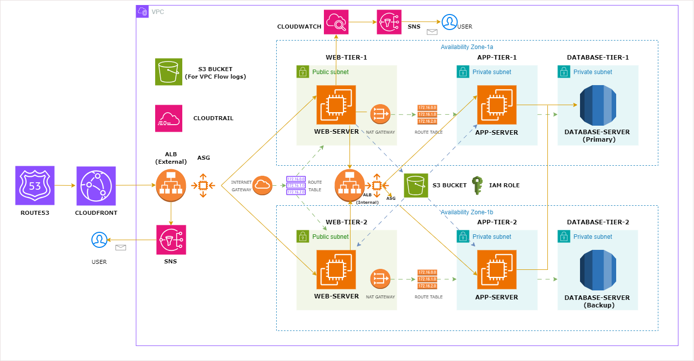

---


# 🎯 Objectives

---


🚀 **Scalability & Availability**  
✅ Ensure High Scalability with dynamic scaling policies for EC2 instances and global content delivery via CloudFront  
✅ Design for High Availability using multi-AZ deployments and Auto Scaling Groups  
✅ Implement Health Checks on ALBs and EC2 for resilience

🔐 **Security**  
✅ Build a Secure Environment using VPC subnet isolation, IAM roles/policies, Security Groups

📊 **Observability & Monitoring**  
✅ Enable Full Observability and traceability through CloudWatch, CloudTrail, and VPC Flow Logs

📬 **Alerting & Notifications**  
✅ Integrate Notification Mechanisms using Amazon SNS for system alerts and monitoring

---
## Architecture Decisions

- **Tier isolation:** the web, application, and database layers use separate subnets and security groups so traffic is permitted only along the required path.
- **High availability:** web and application capacity spans multiple Availability Zones and the database uses a Multi-AZ deployment.
- **Private application/database tiers:** only the external load balancer is internet-facing; internal services remain behind private routing and security-group boundaries.
- **Operational visibility:** CloudWatch, CloudTrail, VPC Flow Logs, and SNS provide metrics, audit history, network visibility, and alerts.
- **Edge protection:** CloudFront and AWS WAF add caching and request filtering before traffic reaches the origin.

---

# AWS Infrastructure Components

## Core Components

### 🚀 Compute Services
- **Amazon EC2**  
  Virtual servers hosting application workloads
- **Auto Scaling**  
  Automatically scales EC2 instances based on demand to ensure high availability

### 🌐 Networking
- **Amazon VPC**  
  Private, isolated network environment for AWS resources
- **Application Load Balancer (ALB)**  
  - Public-facing ALB for external traffic
  - Internal ALB for service-to-service communication
- **Amazon Route 53**  
  DNS management and domain registration service

### 🗄️ Storage
- **Amazon S3**  
  Object storage for static content, application assets, and code

### 🛢️ Database
- **Amazon RDS**  
  Managed relational database with:
  - Primary instance for production traffic
  - Standby replica for high availability and failover

### 🌍 Edge Services
- **Amazon CloudFront**  
  Global CDN for content delivery with low latency
- **AWS WAF**  
  Web Application Firewall protecting against common exploits
- **AWS Shield**  
  DDoS protection service

## Operational Tools

### 📊 Monitoring & Logging
- **Amazon CloudWatch**  
  Centralized metrics, logging, and alerting
- **VPC Flow Logs**  
  Network traffic monitoring for VPC resources
- **AWS CloudTrail**  
  API activity logging and account governance

### 📣 Notifications
- **Amazon SNS**  
  Pub/sub messaging for system alerts and notifications

## 🔐 Security
- **AWS IAM**  
  Identity and access management with granular permissions
- **SSM Access Policies**  
  Enables secure EC2 management without SSH
- **Security Groups**  
  Virtual firewalls controlling instance-level traffic

# AWS Infrastructure Deployment Guide

## Table of Contents
- [Prerequisites](#prerequisites)
- [Deployment Steps](#deployment-steps)
  - [Step 1: Clone Repository](#step-1-clone-repository)
  - [Step 2: Create S3 Buckets](#step-2-create-s3-buckets)
  - [Step 3: IAM Role Setup](#step-3-iam-role-setup)
  - [Step 4: Network Infrastructure](#step-4-network-infrastructure)
  - [Step 5: Security Groups](#step-5-security-groups)
  - [Step 6: Database Setup](#step-6-database-setup)
  - [Step 7: App Server Deployment](#step-7-app-server-deployment)
  - [Step 8: Web Server Deployment](#step-8-web-server-deployment)
  - [Step 9: DNS Configuration](#step-9-dns-configuration)
  - [Step 10: Monitoring Setup](#step-10-monitoring-setup)
  - [Step 11: Security & Compliance](#step-11-security--compliance)
  - [Step 12: Content Delivery & Protection](#step-12-content-delivery)

## Prerequisites
- AWS account or sandbox environment with permissions scoped to the services used by this project
- AWS CLI installed and authenticated with temporary credentials where possible
- Git installed locally
- Application code ready for deployment

> For a learning/lab environment, avoid using the AWS root user and avoid storing long-lived access keys in the repository. Review the resources in this guide before deployment because services such as NAT Gateway, RDS, ALB and CloudFront can incur charges.

## Deployment Steps

### Step 1: Clone Repository
```bash
git clone https://github.com/jaik143/AWS-3-Tier-Architecture.git
cd AWS-3-Tier-Architecture
cd application-code/app-tier

```
- [Test App-Server Commands](./app-server-commands)  
  *(Click to view step-by-step setup and installation commands)*

```bash
cd application-code/app-tier
```
- [Test Web-Server Commands](./web-server-commands)  
  *(Click to view step-by-step setup and installation commands)*


### Step 2: Create S3 Buckets

### Required Buckets

#### 1. Application Code Bucket
- **Purpose**: Stores web and application server deployment packages
- **Features**:
  - Versioning enabled for change tracking
  - Private access configuration
  - Optimized for frequent code deployments

#### 2. VPC Flow Logs Bucket
- **Purpose**: Collects and stores VPC network traffic logs
- **Features**:
  - Standard durability configuration
  - Optimized for log file storage patterns

### Security Implementation
Both buckets are configured with:
- Server-side encryption (SSE-S3)
- Block all public access
- Resource-based access policies
- AWS recommended bucket policies

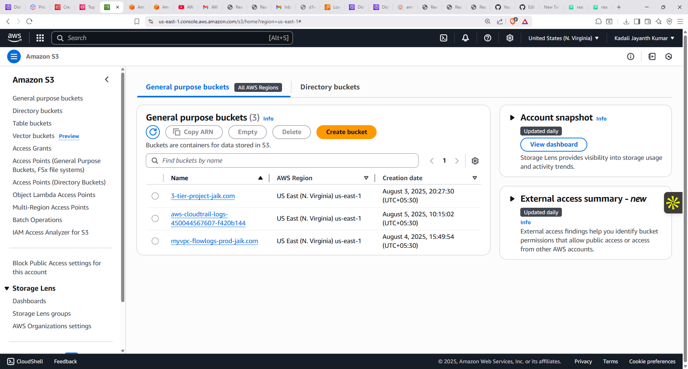

### Step 3: IAM Role Setup

### Required Roles

#### 1. EC2 Instance Role
- **Purpose**: Grants permissions to application servers
- **Attached Policies**:
  - `AmazonS3ReadOnlyAccess` (for code retrieval)
  - `AmazonSSMManagedInstanceCore` (for secure management)
- **Trust Policy**:
  ```json
  {
    "Version": "2012-10-17",
    "Statement": [
      {
        "Effect": "Allow",
        "Action": "sts:AssumeRole",
        "Principal": {
          "Service": "ec2.amazonaws.com"
        }
      }
    ]
  }


- **Features**:
  - Least-privilege access principle
  - Instance profile association

### Security Implementation
All roles include:
- Explicit trust policies
- Permission boundaries
- Resource-level restrictions
- AWS-recommended access patterns

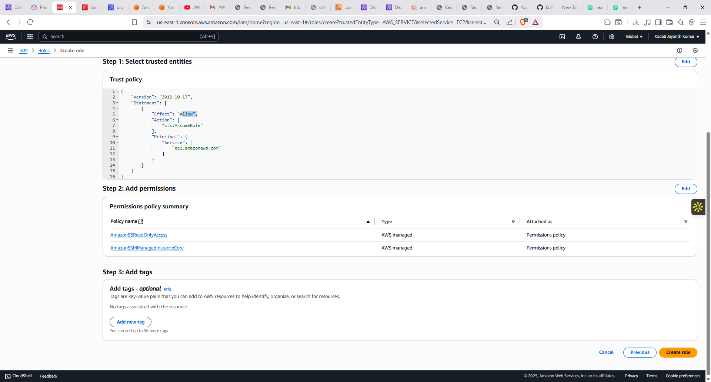

### Step 4: Network Infrastructure

## 🧱 VPC Configuration
- **CIDR Block**: `10.0.0.0/16`

---

## 🗂️ Subnet Allocation

| Type    | Tier      | Availability Zone | CIDR Block     | Auto-assign Public IP |
|---------|-----------|-------------------|----------------|------------------------|
| Public  | Web       | `us-east-1a`      | `10.0.1.0/24`  | ✅ Enabled             |
| Public  | Web       | `us-east-1b`      | `10.0.2.0/24`  | ✅ Enabled             |
| Private | App       | `us-east-1a`      | `10.0.3.0/24`  | ❌ Disabled            |
| Private | App       | `us-east-1b`      | `10.0.4.0/24`  | ❌ Disabled            |
| Private | Database  | `us-east-1a`      | `10.0.5.0/24`  | ❌ Disabled            |
| Private | Database  | `us-east-1b`      | `10.0.6.0/24`  | ❌ Disabled            |

---

## 🌐 Gateways

- **Internet Gateway**: Attached to the VPC for public subnet access
- **NAT Gateway**: Placed in one of the public subnets with an Elastic IP for outbound internet access from private subnets

---

## 📄 VPC Flow Logs

- **Destination**: Existing S3 bucket  
- **Traffic Capture**: All traffic (Accepted, Rejected, All)

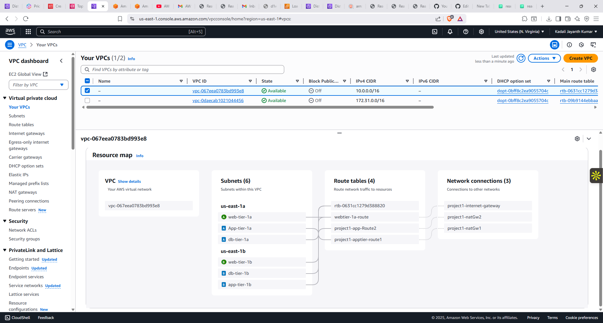
### Step 5: Security Groups

- **External-Load-Balancer-SG**
  - Inbound Rule: HTTP (80) from `0.0.0.0/0`

- **Web-Tier-SG**
  - Inbound Rule: HTTP from `External-Load-Balancer-SG`

- **Internal-Load-Balancer-SG**
  - Inbound Rule: HTTP from `Web-Tier-SG`

- **App-Tier-SG**
  - Inbound Rule: Port 4000 from `Internal-Load-Balancer-SG`

- **DB-Tier-SG**
  - Inbound Rule: MySQL (3306) from `App-Tier-SG`
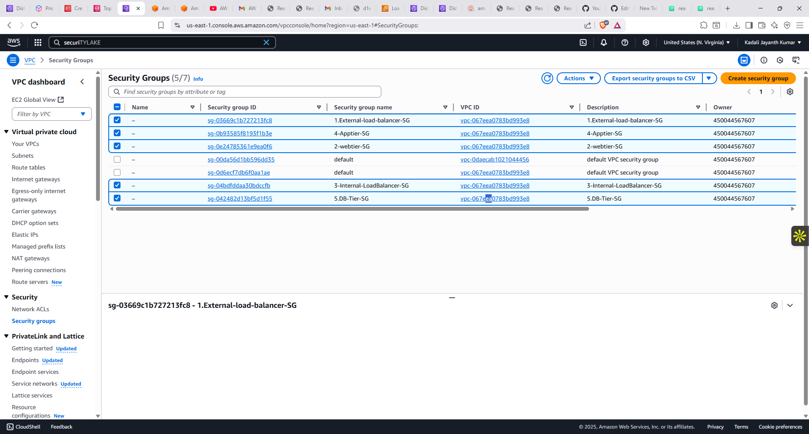
### Step 6: Database Setup

This document outlines the configuration for the database layer of the infrastructure, including subnet groups and Amazon RDS setup.

---

## 1️⃣ DB Subnet Group

### Subnets Included
- **DB-Tier-AZ1**: `10.0.5.0/24`
- **DB-Tier-AZ2**: `10.0.6.0/24`

### Purpose
The DB Subnet Group is designed to provide isolated and high-availability networking for Amazon RDS instances.

### Features
- ✅ **Multi-AZ coverage**: Subnets span across multiple Availability Zones for improved redundancy.
- 🔒 **Private networking**: Subnets are associated with private route tables to prevent public internet exposure.
- 🏷️ **Cost allocation tagging**: Subnets are tagged explicitly for detailed cost tracking.

---

## 2️⃣ Amazon RDS Setup

| Configuration Item     | Value |
|------------------------|-------|
| **Engine**             | MySQL 8.0 / PostgreSQL 13 |
| **Deployment Option**  | Multi-AZ |
| **Instance Class**     | `db.t3.medium`  |
| **Storage**            | 100 GB GP3 (Auto-scaling enabled) |
| **Subnet Group**       | `DB Subnet Group` (defined above) |
| **Security Group**     | `DB-Tier-SG` |
| **Backup Retention**   | 7 days (Dev) / 35 days (Prod) |

---
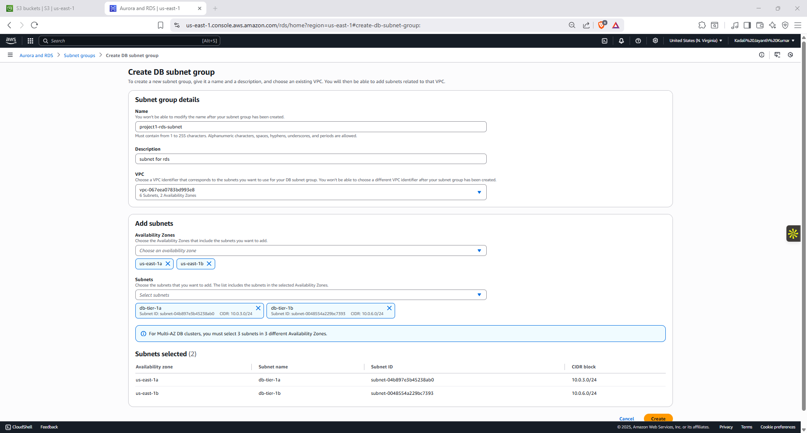
### Step 7: App Server Deployment

This step sets up a basic application server environment to validate infrastructure components before scaling to production.

### ✅ Tasks

- [Test App-Server Commands](./app-server-commands)  
  *(Click to view step-by-step setup and installation commands)*

- Create an **AMI** from the configured test server.

- Create a **Launch Template** using the AMI.

- Create a **Target Group** for the application.

- Set up an **Internal Load Balancer** for internal-only access.

- Create an **Auto Scaling Group** linked to the launch template and target group.

- Edit the local `nginx.conf` file to include the **Internal Load Balancer DNS**.

- Upload the updated `nginx.conf` file to an **S3 bucket** for later retrieval.

---
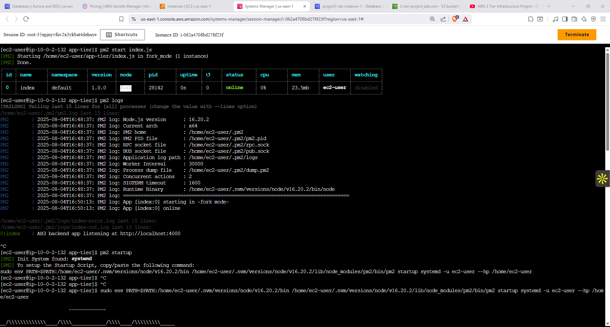
### Step 8: Web Server Deployment

This step provisions a test web server to host frontend applications and validate external access and scaling.

### ✅ Tasks

- [Test Web-Server Commands](./web-server-commands)  
  *(Click to view step-by-step setup and installation commands)*

- Create an **AMI** from the configured test web server.

- Create a **Launch Template** using the AMI.

- Create a **Target Group** for the web application.

- Set up an **External Load Balancer** for public access.

- Create an **Auto Scaling Group** linked to the launch template and target group.

---
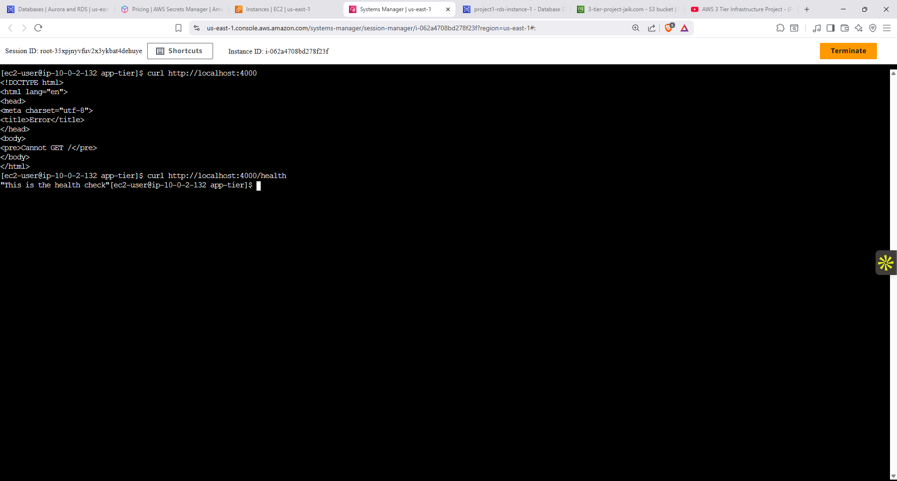
### Step 9: DNS Configuration

This step connects your external Application Load Balancer (ALB) to a custom domain name using Amazon Route 53.

### ✅ Tasks

- Go to the **Route 53 Hosted Zone** for your domain.
- Create a new **A Record (Alias)**.
- Set the **Alias Target** to the **External ALB DNS**.
- Save the record to complete DNS routing.

> This allows users to access the web application using a friendly domain name instead of the raw ALB DNS.

---

### Step 10: Monitoring Setup

Set up monitoring and alerting by creating CloudWatch alarms and linking them to SNS topics for notification delivery.

### ✅ Tasks

- Create relevant **CloudWatch Alarms** for:
  - App Servers
  - Web Servers
  - Load Balancers
  - Auto Scaling Groups

- Create and configure the following **SNS Topics**:
  - **App-server-notifications**
  - **CloudWatch-Notifications**
  - **Web-server-notifications**

> Subscribe email addresses or other endpoints to receive alerts from these topics.

---
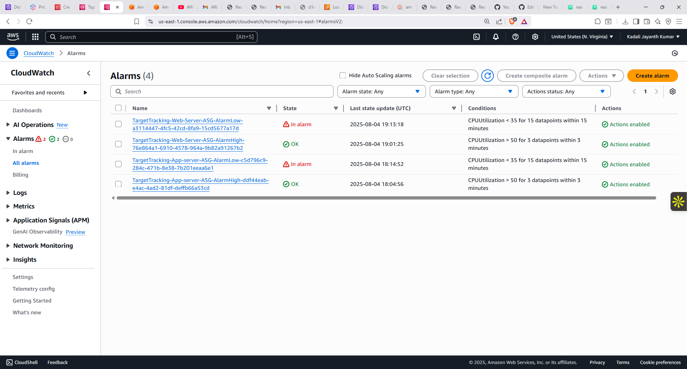
### Step 11: Security & Compliance

Enable AWS CloudTrail to record and monitor account activity across your infrastructure for auditing and security purposes.

### ✅ Tasks

- Create a **CloudTrail trail** to log all management and data events.
- Enable logging for all AWS regions (recommended for full visibility).
- Store logs in a dedicated **S3 bucket** with appropriate access policies.
- Enable log file validation for integrity verification.
- Optionally, configure CloudTrail to send events to **CloudWatch Logs** for real-time monitoring and alerting.

> CloudTrail helps ensure compliance, security auditing, and troubleshooting by capturing detailed API activity.

---
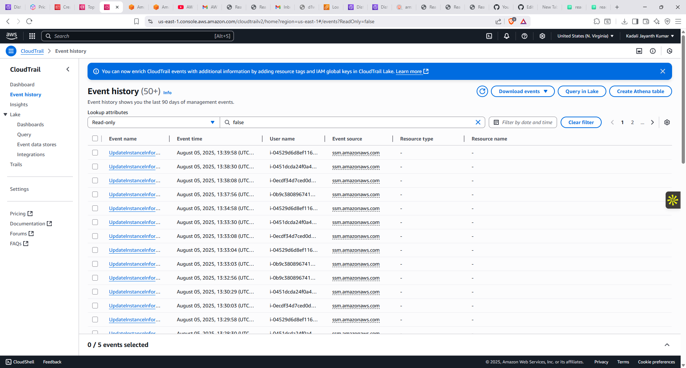
### Step 12: Content Delivery

Use Amazon CloudFront to deliver your web content securely and with low latency via a global content delivery network (CDN).

### ✅ Tasks

- Create a **CloudFront distribution**.
- Set the **origin** as the External Load Balancer  (for static assets).
- Configure **cache behaviors** for optimal performance.
- Enable **HTTPS (SSL/TLS)** for secure content delivery.
- Set custom domain (CNAME) if using your own domain with Route 53.
- Optionally enable **WAF (Web Application Firewall)** for extra security.

> CloudFront improves global performance and adds an extra layer of protection for your web application.

---
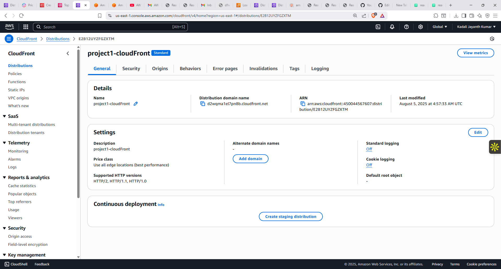

---

## Cost & Cleanup

After testing, remove resources that continue to incur charges. Pay particular attention to NAT Gateways, Application Load Balancers, RDS instances, public IPv4 addresses, CloudFront distributions, and retained logs/snapshots. Verify dependencies before deleting shared resources.

---

## 📬 Contact

For questions, feedback, or collaboration opportunities, feel free to reach out:

**GitHub**: [jaik143](https://github.com/jaik143)  
**LinkedIn**: [Jayanth Kumar Kadali](https://www.linkedin.com/in/jayanth-kadali-419798182)

---
